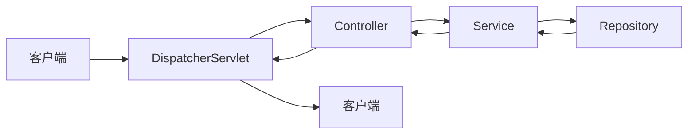

# Spring Boot 三层架构学习笔记

## 1. 三层架构概述
三层架构（Three-Tier Architecture）是将应用划分为“表现层（Presentation Layer）”、“业务逻辑层（Service Layer）”和“持久层（Persistence/DAO Layer）”的经典模式。  
- **表现层**：处理用户请求，负责数据展示与交互。  
- **业务逻辑层**：封装核心业务逻辑，协调各模块。  
- **持久层**：与数据库或其他存储进行交互，完成数据增删改查。

## 2. 各层职责

### 2.1 表现层（Controller）
- 接收并校验前端请求（参数校验、权限校验等）。  
- 调用 Service 层执行业务操作。  
- 将 Service 返回结果转换为响应格式（JSON、View 等）。

```java
@RestController
@RequestMapping("/api/users")
public class UserController {

    @Autowired
    private UserService userService;

    @GetMapping("/{id}")
    public ResponseEntity<UserDTO> getUser(@PathVariable Long id) {
        UserDTO user = userService.findById(id);
        return ResponseEntity.ok(user);
    }

    @PostMapping
    public ResponseEntity<UserDTO> createUser(@Valid @RequestBody UserDTO dto) {
        UserDTO created = userService.create(dto);
        return ResponseEntity.status(HttpStatus.CREATED).body(created);
    }
}
````

### 2.2 业务逻辑层（Service）

- 定义业务接口与实现，封装核心业务规则。
    
- 事务管理：通过 `@Transactional` 注解控制事务边界。
    
- 可能调用多个 DAO 层或第三方服务。
    

```java
@Service
public class UserServiceImpl implements UserService {

    @Autowired
    private UserRepository userRepository;

    @Override
    @Transactional(readOnly = true)
    public UserDTO findById(Long id) {
        UserEntity entity = userRepository.findById(id)
            .orElseThrow(() -> new ResourceNotFoundException("User not found"));
        return UserMapper.INSTANCE.toDto(entity);
    }

    @Override
    @Transactional
    public UserDTO create(UserDTO dto) {
        UserEntity entity = UserMapper.INSTANCE.toEntity(dto);
        UserEntity saved = userRepository.save(entity);
        return UserMapper.INSTANCE.toDto(saved);
    }
}
```

### 2.3 持久层（Repository/DAO）

- 负责与数据库进行直接交互。
    
- 推荐使用 Spring Data JPA、MyBatis 等框架减少模板代码。
    
- 可以自定义复杂 SQL 或使用 QueryDSL。
    

```java
public interface UserRepository extends JpaRepository<UserEntity, Long> {
    // 根据用户名查找
    Optional<UserEntity> findByUsername(String username);
}
```

## 3. 实现示例

### 3.1 项目结构

```
src
├─ main
│  ├─ java
│  │  └─ com.example.demo
│  │     ├─ controller
│  │     │   └─ UserController.java
│  │     ├─ service
│  │     │   ├─ UserService.java
│  │     │   └─ UserServiceImpl.java
│  │     ├─ repository
│  │     │   └─ UserRepository.java
│  │     ├─ entity
│  │     │   └─ UserEntity.java
│  │     └─ dto
│  │         └─ UserDTO.java
│  └─ resources
│      ├─ application.properties
│      └─ schema.sql
```

### 3.2 关键配置（`application.properties`）

```properties
spring.datasource.url=jdbc:mysql://localhost:3306/demo?useSSL=false&serverTimezone=UTC
spring.datasource.username=root
spring.datasource.password=secret

spring.jpa.show-sql=true
spring.jpa.hibernate.ddl-auto=update
spring.jackson.serialization.indent_output=true
```

## 4. 配置与注解

|注解|位置|功能|
|---|---|---|
|`@RestController`|Controller|声明 REST 控制器，自动 `@ResponseBody`|
|`@Service`|Service Impl|声明业务逻辑组件|
|`@Repository`|Repository|声明持久层组件，并触发 Spring Data 异常转换|
|`@Transactional`|Service|声明事务边界|
|`@Autowired` / `@Resource`|任意层|自动注入依赖|

## 5. 请求处理流程

1. **客户端** 发起 HTTP 请求 →
    
2. **DispatcherServlet** 接收并分发到相应的 **Controller** →
    
3. **Controller** 校验参数，调用 **Service** →
    
4. **Service** 启动事务，执行业务逻辑，调用 **Repository** →
    
5. **Repository** 执行数据库操作，返回实体 →
    
6. **Service** 提交/回滚事务，返回 DTO →
    
7. **Controller** 返回 HTTP 响应给客户端。
    



## 6. 常见最佳实践

- **接口与实现分离**：`UserService` vs `UserServiceImpl`，便于 AOP、Mock 测试。
    
- **DTO 与 Entity 分离**：避免直接暴露数据库结构；使用 MapStruct、ModelMapper 进行映射。
    
- **事务最小化原则**：只在需要写操作的方法上开启事务；读操作可标注 `readOnly=true`。
    
- **异常处理**：使用 `@ControllerAdvice` 全局处理，统一返回错误格式。
    
- **分页与排序**：利用 Spring Data JPA 的 `Pageable` 接口，避免一次性加载过多数据。
    
- **参数校验**：使用 JSR-303 注解（`@NotNull`、`@Size` 等）+ `@Valid`。
    

## 7. 总结

Spring Boot 三层架构将应用逻辑清晰地分为表现、业务、持久三部分，既提高了关注点分离（Separation of Concerns），又增强了代码的可测试性、可维护性与可扩展性。在实际项目中，可根据业务复杂度进一步拆分或合并层次，但核心思想始终不变。